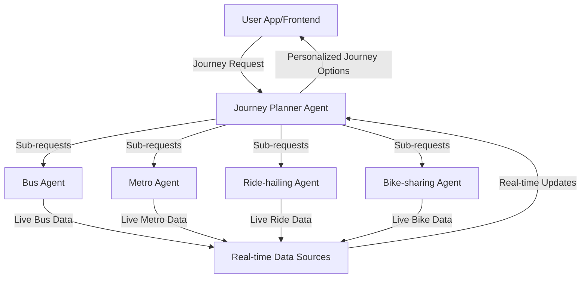

# Urban Mobility Coordination for Smart Cities

## Problem Statement

Urban commuters face fragmented transportation services, missed connections, and a lack of real-time responsiveness. The challenge is to design a system where agents representing buses, metros, ride-hailing, and bike-sharing collaborate to provide seamless, end-to-end travel planning for city residents.

---

## Goals

-   **Seamless Journey Planning:** Enable commuters to plan trips across multiple transport modes in a single, unified experience.
-   **Real-Time Responsiveness:** Adapt journey recommendations based on live data (delays, availability, traffic).
-   **Agent Collaboration:** Allow transport service agents to share data and co-create optimal, personalized journey options.

---

## Key Frictions to Solve

-   Disconnected transport services
-   Missed connections and delays
-   Lack of real-time responsiveness to changing commuter needs

---

## System Overview

### Architecture Diagram

---

## Core Components

### 1. Agents

-   **Journey Planner Agent:** Orchestrates journey planning, queries all transport agents, aggregates and optimizes results.
-   **Bus Agent:** Provides bus schedules, real-time locations, and delay info.
-   **Metro Agent:** Provides metro schedules, real-time locations, and delay info.
-   **Ride-hailing Agent:** Provides ride availability, ETA, and pricing.
-   **Bike-sharing Agent:** Provides bike availability, dock locations, and status.

### 2. Real-Time Data Layer

-   Aggregates live data from all transport services.
-   Pushes updates to agents and the planner.

### 3. User Interface

-   Allows users to input journey requests and preferences.
-   Displays optimal, real-time journey options and updates.

---

## Data Flow

1. **User submits journey request** (origin, destination, preferences).
2. **Journey Planner Agent** queries all transport agents in parallel.
3. **Each Transport Agent** responds with possible legs, factoring in real-time data.
4. **Journey Planner Agent** assembles, optimizes, and personalizes journey options.
5. **User receives journey options** with live updates and notifications for changes.

---

## Key Features

-   **Multi-modal Journey Planning:** Combine bus, metro, ride-hailing, and bike-sharing in one trip.
-   **Real-Time Updates:** Notify users of delays, missed connections, or better alternatives.
-   **Personalization:** Adapt to user preferences (e.g., fastest, cheapest, least walking).
-   **Agent Collaboration:** Agents share data and coordinate to minimize transfer times and missed connections.

---

## Handling Key Frictions

-   **Disconnected Services:** Unified planner agent and shared data layer.
-   **Missed Connections/Delays:** Real-time monitoring and dynamic re-routing.
-   **Lack of Responsiveness:** Agents push updates and planner re-optimizes journeys instantly.

---

## Example User Flow

1. User requests a journey from A to B.
2. Planner agent queries all transport agents for available options.
3. Agents respond with real-time data (e.g., next bus in 5 min, metro delayed by 10 min, bikes available at nearby dock).
4. Planner agent assembles the best options and presents them to the user.
5. If a delay occurs, the user is notified and given alternatives.

---

## Future Extensions

-   Integration with payment systems for unified ticketing.
-   Support for additional transport modes (e-scooters, ferries).
-   Predictive analytics for demand and congestion.

---

## Conclusion

This system leverages agent-based collaboration and real-time data sharing to provide seamless, responsive, and personalized urban mobility for smart cities.
